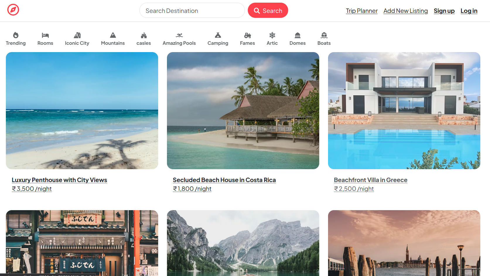
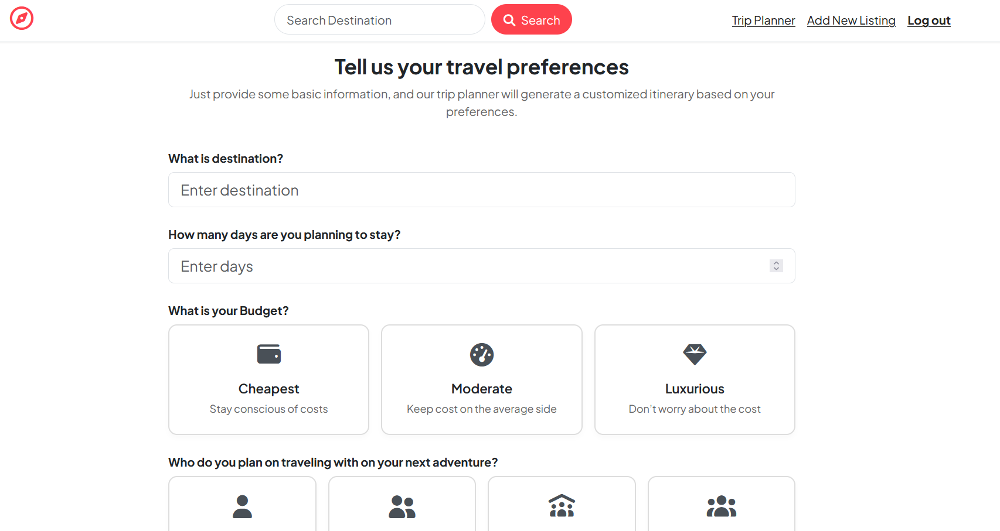
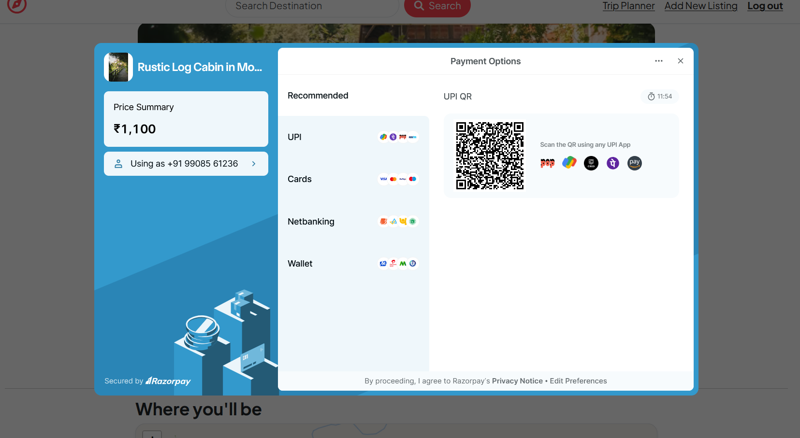

# Heavenly 🌟 — Your AI-Powered Gateway to Personalized Travel

Heavenly is a premium full-stack travel platform designed to bridge the gap between wanderlust and a perfectly executed plan. Built for the modern traveler, it combines a curated listing ecosystem with cutting-edge **Generative AI** to craft bespoke itineraries.


## 📌 Problem Statement
Traditional travel planning is fragmented. Travelers jump between listing sites, budget spreadsheets, and manual research. **Heavenly** solves this by consolidating discovery, booking, and planning into one seamless experience. Whether you're a solo adventurer or a family planner, Heavenly provides the tools to turn a destination into a detailed, ready-to-go journey.

---

## 🚀 Key Features

### 🏠 Listing & Discovery Ecosystem
- **Curated Terrains:** Discover stays categorized by atmosphere—be it serene beaches, rugged mountains, or lush forests.
- **Dynamic Management:** Responsive interfaces for owners to list and manage properties with ease.
- **Interactive Geospatial View:** Powered by **Leaflet.js**, offering real-time location visualization.

### 🤖 AI-Magic: Personalized Trip Planner
- **Intelligent Itineraries:** Leverages **Google Gemini AI** to generate structured travel plans based on your budget, group size, and duration.
- **Smart Logic:** Unlike static templates, our AI understands context, suggesting hotels and activities that fit your specific profile.
- **Real-time Generation:** Get a day-by-day breakdown including estimated costs and travel times in seconds.

### 💳 Seamless & Secure Payments
- **Razorpay Integration:** A production-grade payment flow supporting UPI, Net Banking, and Cards.
- **Transaction Integrity:** Implements backend signature verification to ensure every rupee is accounted for.

### ✍️ Social Proof & Community
- **Robust Review System:** Integrated star ratings and feedback loop for every listing.
- **Secure Moderation:** Multi-layered authorization ensuring users manage only their own data.

---

## 📸 Project Gallery

### Main Listing & Discovery

> 

> 

### Secure Checkout Experience

> 

### Trip Generated
*(A screenshot of the AI-generated trip plan)*
> 

---

## 🛠️ Tech Stack: The "Why" Factor

| Technology | Role | Why This? |
| :--- | :--- | :--- |
| **MongoDB Atlas** | Database | NoSQL's flexible schema is perfect for varied listing attributes and JSON-native AI responses. |
| **Express & Node.js** | Backend | Delivers the high-concurrency performance needed for real-time AI and payment processing. |
| **Google Gemini SDK** | Generative AI | Provides superior contextual intelligence for high-fidelity itineraries over standard LLMs. |
| **EJS & EJS-Mate** | Templating | Server-side rendering ensures lightning-fast initial loads and robust SEO. |
| **Razorpay** | Payments | The gold standard for payment reliability and security in the Indian ecosystem. |
| **Cloudinary** | Storage | Offloads heavy image processing to the cloud for a smoother user experience. |

---

## ⚙️ Installation & Setup

### 1. Clone & Enter
```bash
git clone https://github.com/MdTowfikOmer/Heavenly.git
cd Heavenly
```

### 2. Dependency Management
```bash
npm install
```

### 3. Environment Configuration
Create a `.env` file in the root directory:
```env
# Cloudinary Keys
CLOUD_NAME=your_cloudinary_name
CLOUD_API_KEY=your_cloudinary_key
CLOUD_API_SECRET=your_cloudinary_secret

# Database & Session
ATLASDB_URL=your_mongodb_atlas_url
SECRET=your_session_secret

# AI & Payments
GOOGLE_GEMINI_AI_KEY=your_gemini_api_key
RAZORPAY_KEY_ID=your_razorpay_key_id
RAZORPAY_KEY_SECRET=your_razorpay_key_secret
```

### 4. Initialization (Optional)
Seed the database with sample data:
```bash
node init/index.js
```

### 5. Launch
```bash
node app.js
```
The app will be live at `http://localhost:3000`.

---

## 📂 Project Structure & Architecture (MVC)

Heavenly follows a clean **Model-View-Controller** architecture to ensure maintainability.

```text
Heavenly/
├── controller/    # Route logic & Business processes (C)
├── models/        # Mongoose schemas & Data validation (M)
├── views/         # EJS templates & UI components (V)
├── routes/        # URL mapping & Middleware protection
├── public/        # Frontend assets (Vanilla CSS, Client-side JS)
├── utils/         # Global Error handlers & WrapAsync utilities
├── app.js         # Entry point & Middleware orchestration
└── cloudConfig.js # Third-party configuration (Cloudinary)
```

---

## 🔮 Future Improvements
- [ ] **Real-time Notifications:** WebSocket integration for booking updates.
- [ ] **Price Forecasting:** AI-driven insights to find the best time to book.
- [ ] **PWA Support:** Turning Heavenly into an offline-capable mobile experience.
- [ ] **Multi-Currency Support:** Globalizing the payment gateway.

---

## 📄 License
Federated under the **ISC License**. See the `LICENSE` file for details.

---
Developed with ❤️ by [Towfik Omer](https://github.com/MdTowfikOmer) | [Portfolio](https://github.com/MdTowfikOmer)
